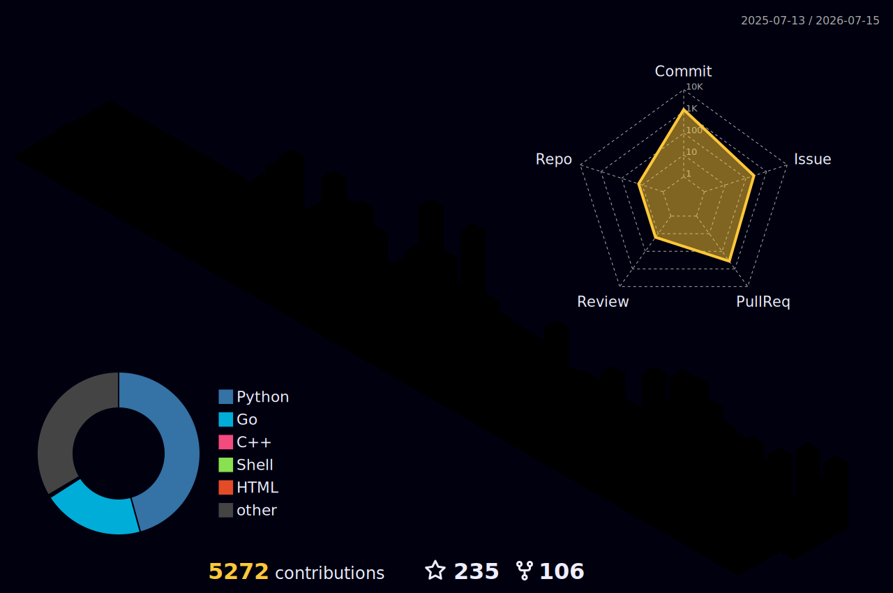

# Hi, I'm Marco Mornati 👋 

  

---

### 🏛️ Engineering Leadership & Culture
I am a **Director of Engineering** at **Decathlon Digital**, where I lead teams in building global omnichannel experiences. My leadership philosophy is rooted in **Happiness-Driven Development**, autonomy, and radical technical excellence.

- 🌍 **Scaling Platforms:** Orchestrating high-traffic systems across the global Decathlon ecosystem.
- 🧘 **Culture First:** Believer in psychological safety as the primary driver for high-performing teams.
- 🧪 **Vibe Coding:** Experimenting with AI-orchestrated development and "Zero-to-One" prototyping.
- 🧰 **AI Toolkit:** `Claude Code` · `Cursor` · `GitHub Copilot` · `MCP Toolbox` — actively shipping with them.

---

### 🕒 What I'm doing "Now"
*Inspired by the [Sivers Now page](https://nownownow.com/about) concept.*

- 🛡️ **Cyber Code Academy:** Building a secure Python sandbox for educational purposes.
- 🏠 **Smart Home:** Enhancing my [Hitachi CSNET Home integration](https://github.com/mmornati/home-assistant-csnet-home) for the Home Assistant community.
- ✍️ **Writing:** Sharing architectural deep-dives on [blog.mornati.net](https://blog.mornati.net).

---

### 📊 Vital Signs & Activity Stream

  

---

### 🏆 GitHub Achievements

  

  

---

### 🛠️ The Architect's Toolkit

| **Backend & Architecture** | **DevOps & Cloud** | **Automation & Fun** |
| :--- | :--- | :--- |
|   |   |  |
|   |   |  |

---

### 📝 Latest from the Blog
<!-- BLOG-POST-LIST:START -->
- [The AI Orchestrator: Why Intelligent Delegation is the Missing Piece in Your AI Toolchain](https://blog.mornati.net/the-ai-orchestrator-why-intelligent-delegation-is-the-missing-piece-in-your-ai-toolchain) — 1. Introduction: The Age of Model Abundance The AI assistant landscape in mid-2026 is one of abundance. According to McKinsey's State of AI report, 78% of organizations now use AI regularly, and the n- [Lifting the Lid on Copilot's Black Box: Observability for LLM Code Generation](https://blog.mornati.net/lifting-the-lid-on-copilot-s-black-box-observability-for-llm-code-generation) — Introduction: The Black Box of AI Code Generation When you ask GitHub Copilot to write a function, refactor a module, or explain a complex piece of code, the response you get is the output of a probab- [Your AI Agent Deserves a Tool Harness, Not a Wild West](https://blog.mornati.net/your-ai-agent-deserves-a-tool-harness-not-a-wild-west) — We started the same way everyone does: give the LLM access to everything and hope it figures it out. Connect the GitHub MCP, the Jira MCP, the internal product API MCP, throw in a database schema or t- [The Hidden Tax on Every AI Request: How MCP Servers Are Draining Your Token Budget](https://blog.mornati.net/the-hidden-tax-on-every-ai-request-how-mcp-servers-are-draining-your-token-budget) — Last month, I published a comparison: MCP Servers vs. CLI. Single server (GitHub), controlled test, clear conclusion: Native MCP wastes 99.7% on schema tax in typical sessions. But that's a lab test.- [The Future of Agentic Tooling: MCP Servers vs. CLI  A Data-Driven Comparison](https://blog.mornati.net/the-future-of-agentic-tooling-mcp-servers-vs-cli-a-data-driven-comparison) — As Large Language Models (LLMs) evolve into autonomous coding agents, one of the most consequential architectural decisions is deceptively simple: how should an AI agent talk to external services? Tra
<!-- BLOG-POST-LIST:END -->
---

### 🛸 3D Contribution Graph

  

---

### 🐘 Latest from Mastodon
<!-- MASTODON-LATEST:START -->
💬 🚀 The LLM Zoo in 2026: How not to go crazy? Today, opening your AI toolbox means facing a dizzying abundance: GPT-4.1, Claude 4 Sonnet, DeepSeek-V3, Gemini 2.5... Choosing the right model for the right task has become a software engineering problem in itself. ❌ The problem: Manual selection is unmanageable. Worse, burning a super-premium, expensive model to format a simple docstring... 
 
 — [view on Mastodon](https://techhub.social/@mmornati/116826962282344932)
<!-- MASTODON-LATEST:END -->

---

### 📫 Let's Connect

  <i>“Move People Through the Wonders of Sport” — 🏃‍♂️ Proudly part of Decathlon Digital.</i>

