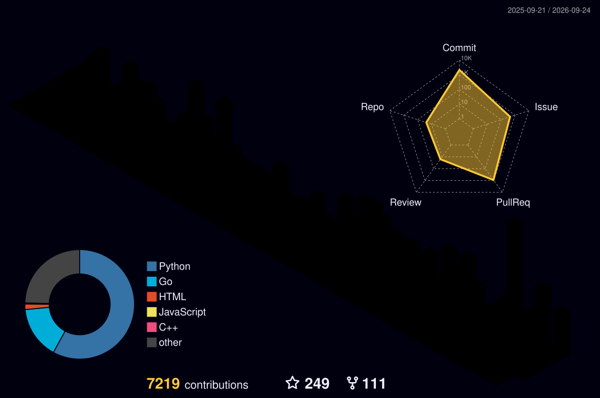

# Hi, I'm Marco Mornati 👋 

  

---

### 🏛️ Engineering Leadership & Culture
I am a **Director of Engineering** at **Decathlon Digital**, where I lead teams in building global omnichannel experiences. My leadership philosophy is rooted in **Happiness-Driven Development**, autonomy, and radical technical excellence.

- 🌍 **Scaling Platforms:** Orchestrating high-traffic systems across the global Decathlon ecosystem.
- 🧘 **Culture First:** Believer in psychological safety as the primary driver for high-performing teams.
- 🧪 **Vibe Coding:** Experimenting with AI-orchestrated development and "Zero-to-One" prototyping.
- 🧰 **AI Toolkit:** `Claude Code` · `Cursor` · `GitHub Copilot` · `MCP Toolbox` — actively shipping with them.

---

### 🕒 What I'm doing "Now"
*Inspired by the [Sivers Now page](https://nownownow.com/about) concept.*

- 🛡️ **Cyber Code Academy:** Building a secure Python sandbox for educational purposes.
- 🏠 **Smart Home:** Enhancing my [Hitachi CSNET Home integration](https://github.com/mmornati/home-assistant-csnet-home) for the Home Assistant community.
- ✍️ **Writing:** Sharing architectural deep-dives on [blog.mornati.net](https://blog.mornati.net).

---

### 📊 Vital Signs

  

---

### 🛸 3D Contribution Graph

  

---

### 🏆 GitHub Achievements

  

  

---

### 🛠️ The Architect's Toolkit
| **Backend & Architecture** | **DevOps & Cloud** | **Automation & Fun** |
| :--- | :--- | :--- |
|   |   |  |
|   |   |  |

---

### 📝 Latest from the Blog
<!-- BLOG-POST-LIST:START -->
- [Jev in Home Assistant: Letting a Decision Model Make the Judgement Calls](https://blog.mornati.net/jev-home-assistant-letting-a-decision-model-judge-my-automations/) — My automations are good at thresholds and bad at context. Jev answers typed questions with a calibrated probability, for about two thousandths of a cent each. Here is how I wired it into Home Assistan...
- [system-one-router: Letting a "System One" Model Pick the Right LLM for Every Prompt](https://blog.mornati.net/system-one-router-picking-the-right-llm-for-every-prompt/) — My first model router let an LLM read a prompt file and pick an agent. This one asks a &ldquo;System One&rdquo; decision model four typed questions, scores the models with plain arithmetic, and publis...
- [Preparing an Ultra-Trail with ai-running-coach: From Planning to the Finish Line](https://blog.mornati.net/preparing-an-ultra-trail-with-ai-running-coach/) — 
- [Searching Proton Photos like it's Google Photos: how I built proton-faces](https://blog.mornati.net/proton-faces-search-proton-photos/) — E2E encryption means Proton can never index your photos. So I built a two-container search engine that does it locally, on my own hardware, without ever writing back to Proton.
- [The Sump Pump in the Spotlight: Monitoring Hidden Infrastructure with Home Assistant](https://blog.mornati.net/monitoring-the-sump-pump-with-home-assistant/) — A Zigbee smart plug, nine automations, and one invisible pump that saves the house from flooding - the &ldquo;invisible device&rdquo; pattern, monitored with Home Assistant.

<!-- BLOG-POST-LIST:END -->

---

### 🐘 Latest from Mastodon
<!-- MASTODON-LATEST:START -->
💬 My home automations know thresholds, not context. Sump pump runs 2 min after a rainy night → alert. Long shower → &quot;possible leak&quot;. Washer pauses to soak → &quot;finished&quot;, 20 min too early. So I gave the &quot;is this normal?&quot; question to Jev, TypeSafe&#39;s decision model. You send it a few lines of facts and a typed question, and it answers with a cal... 
 
 — [view on Mastodon](https://techhub.social/@mmornati/117333679006590167)
<!-- MASTODON-LATEST:END -->

---

### 📫 Let's Connect

  <i>“Move People Through the Wonders of Sport” — 🏃‍♂️ Proudly part of Decathlon Digital.</i>

