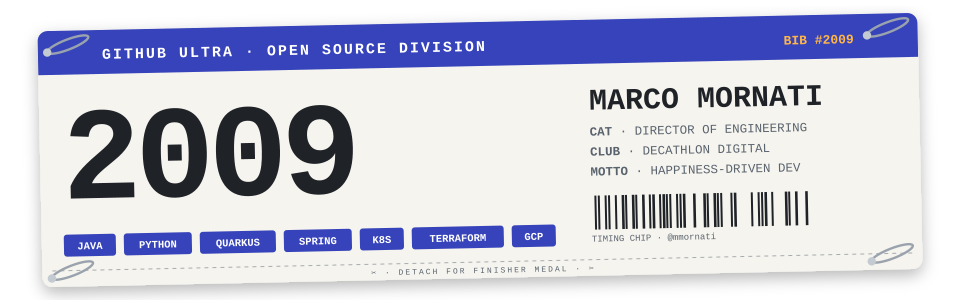

  

  <picture>
    <source media="(prefers-color-scheme: dark)" srcset="./assets/boot/boot-dark.svg" />
    <source media="(prefers-color-scheme: light)" srcset="./assets/boot/boot-light.svg" />
    
  </picture>

---

### 🏛️ Engineering Leadership & Culture
I am a **Director of Engineering** at **Decathlon Digital**, where I lead teams in building global omnichannel experiences. My leadership philosophy is rooted in **Happiness-Driven Development**, autonomy, and radical technical excellence.

- 🌍 **Scaling Platforms:** Orchestrating high-traffic systems across the global Decathlon ecosystem.
- 🧘 **Culture First:** Believer in psychological safety as the primary driver for high-performing teams.
- 🧪 **Vibe Coding:** Experimenting with AI-orchestrated development and "Zero-to-One" prototyping.
- 🧰 **AI Toolkit:** `Claude Code` · `Cursor` · `GitHub Copilot` · `MCP Toolbox` — actively shipping with them.

---

### 🕒 What I'm doing "Now"
*Inspired by the [Sivers Now page](https://nownownow.com/about) concept.*

- 🛡️ **Cyber Code Academy:** Building a secure Python sandbox for educational purposes.
- 🏠 **Smart Home:** Enhancing my [Hitachi CSNET Home integration](https://github.com/mmornati/home-assistant-csnet-home) for the Home Assistant community.
- ✍️ **Writing:** Sharing architectural deep-dives on [blog.mornati.net](https://blog.mornati.net).

---

### ⛰️ Commit Ultra-Trail

  <picture>
    <source media="(prefers-color-scheme: dark)" srcset="./assets/trail/trail-dark.svg" />
    <source media="(prefers-color-scheme: light)" srcset="./assets/trail/trail-light.svg" />
    
  </picture>

---

### 🗺️ The Mornati Massif

  <picture>
    <source media="(prefers-color-scheme: dark)" srcset="./assets/massif/massif-dark.svg" />
    <source media="(prefers-color-scheme: light)" srcset="./assets/massif/massif-light.svg" />
    
  </picture>

---

### 🏅 Finisher Medals

  <picture>
    <source media="(prefers-color-scheme: dark)" srcset="./assets/medals/medals-dark.svg" />
    <source media="(prefers-color-scheme: light)" srcset="./assets/medals/medals-light.svg" />
    
  </picture>

---

### 🛠️ The Architect's Toolkit
| **Backend & Architecture** | **DevOps & Cloud** | **Automation & Fun** |
| :--- | :--- | :--- |
|   |   |  |
|   |   |  |

---

### 🌿 git log --graph
Blog posts land on <code>main</code>, toots from <a href="https://techhub.social/@mmornati">Mastodon</a> branch off and merge back.

<!-- FEED:START -->
<pre>
| * <b>cb9793c</b> 2026-10-03 (HEAD -&gt; toots, toot) <a href="https://techhub.social/@mmornati/117376523535607666">New post: Laya vs Jev, ten days later 🧠⚖️ Ten days ago I benchmarked…</a>
|/
* <b>0532772</b> 2026-10-03 (blog) <a href="https://blog.mornati.net/laya-vs-jev-ten-days-later-fine-tuning-on-a-macbook/">Laya vs Jev, Ten Days Later: New Rivals, a Fine-Tune on My MacBook, and…</a>
* <b>3a9ff6b</b> 2026-10-02 (blog) <a href="https://blog.mornati.net/ai-running-coach-five-days-later-chat-gear-map-videos/">ai-running-coach, Five Days Later: a Chat, a Gear Locker, a GPS Map and…</a>
|\
| * <b>1491e4f</b> 2026-09-30 (toot) <a href="https://techhub.social/@mmornati/117361646469115012">The new proton-faces website made by opus 5.5. It is really amazing to…</a>
| * <b>a161a86</b> 2026-09-29 (toot) <a href="https://techhub.social/@mmornati/117352748046462856">With Opus 5.5 nothing is impossible. It is doing anything in a very…</a>
| * <b>b60cc17</b> 2026-09-28 (toot) <a href="https://techhub.social/@mmornati/117347053918052803">🏃‍♂️ Petite mise à jour de mon coach IA… qui a bien grandi en 9 jours !…</a>
|/
* <b>45772d2</b> 2026-09-28 (blog) <a href="https://blog.mornati.net/ai-running-coach-whats-new-dashboard-metrics-mobile-coach/">ai-running-coach, Nine Days Later: a Dashboard, 20+ Metrics and a Coach…</a>
|\
| * <b>0401b5d</b> 2026-09-26 (toot) <a href="https://techhub.social/@mmornati/117338515337951727">Follow-up to my Jev × Home Assistant post: two comments on the last one…</a>
|/
* <i>… older history on <a href="https://blog.mornati.net">blog.mornati.net</a></i>
</pre>
<!-- FEED:END -->

---

### 📫 Let's Connect

  <i>“Move People Through the Wonders of Sport” — 🏃‍♂️ Proudly part of Decathlon Digital.</i>

